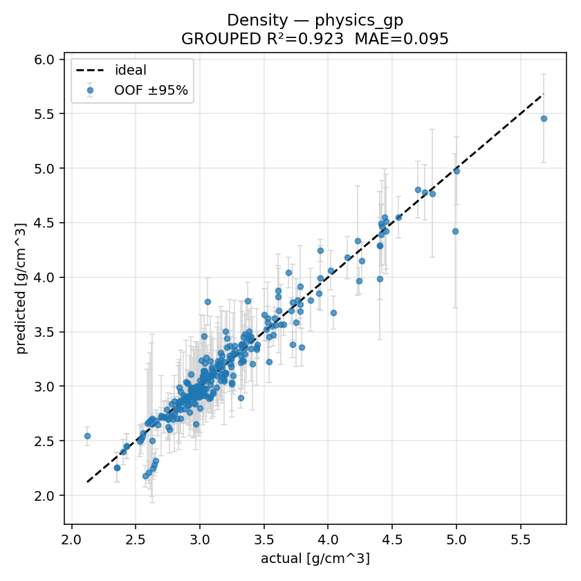
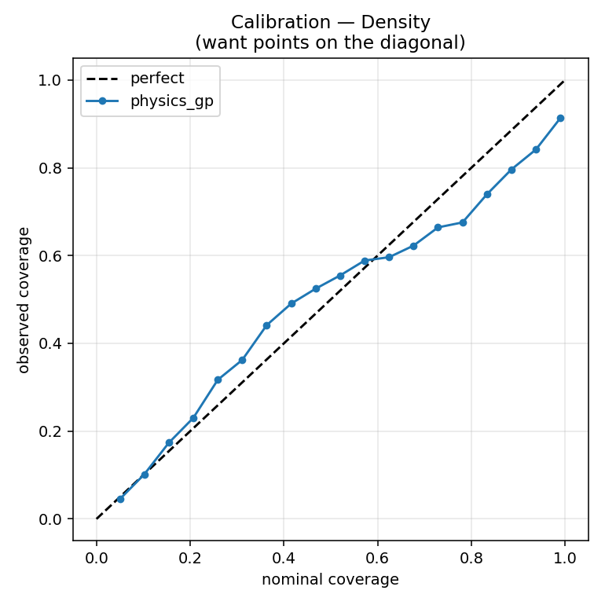
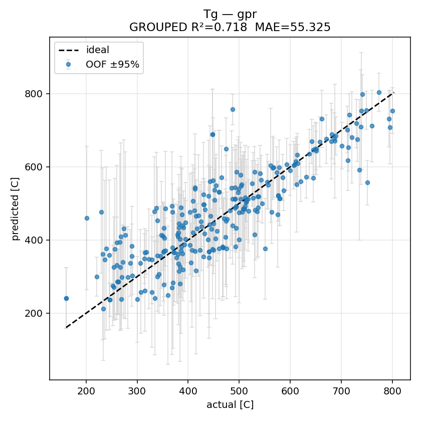
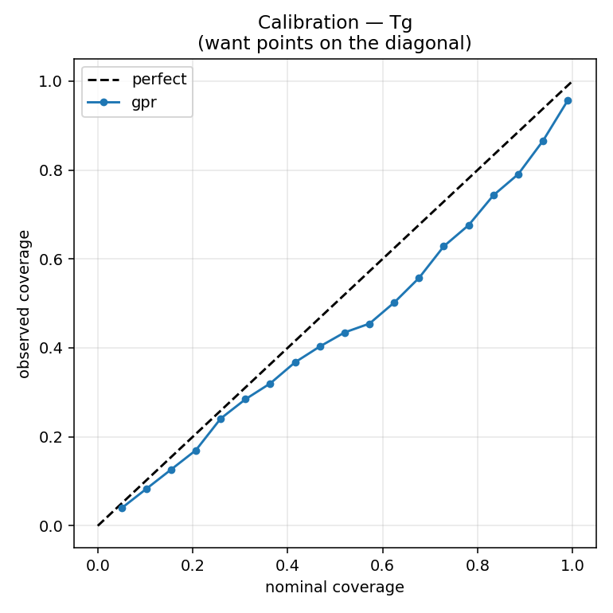
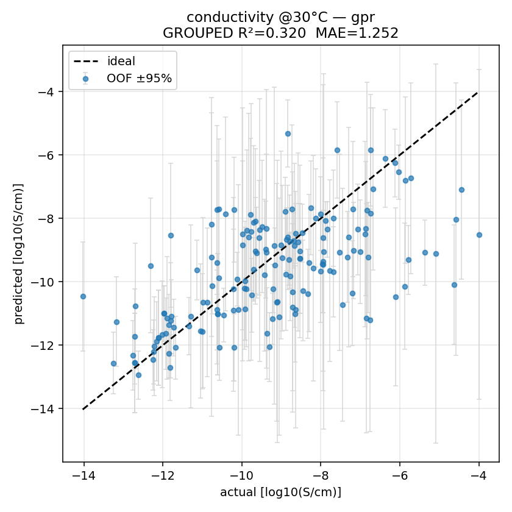
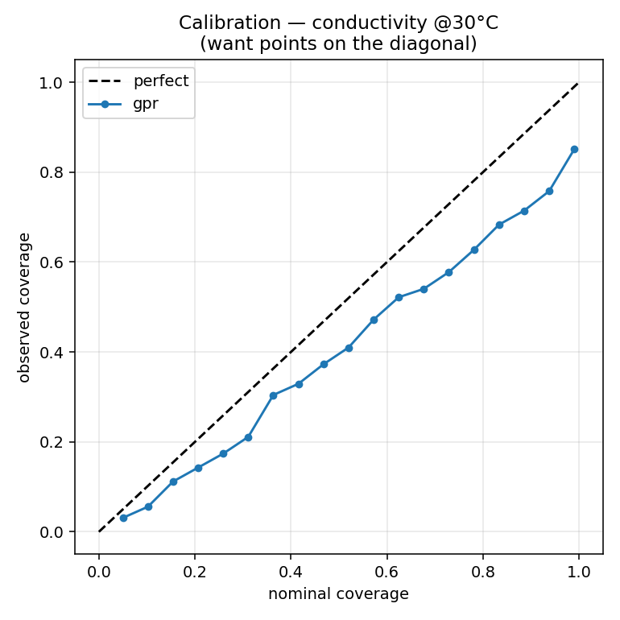
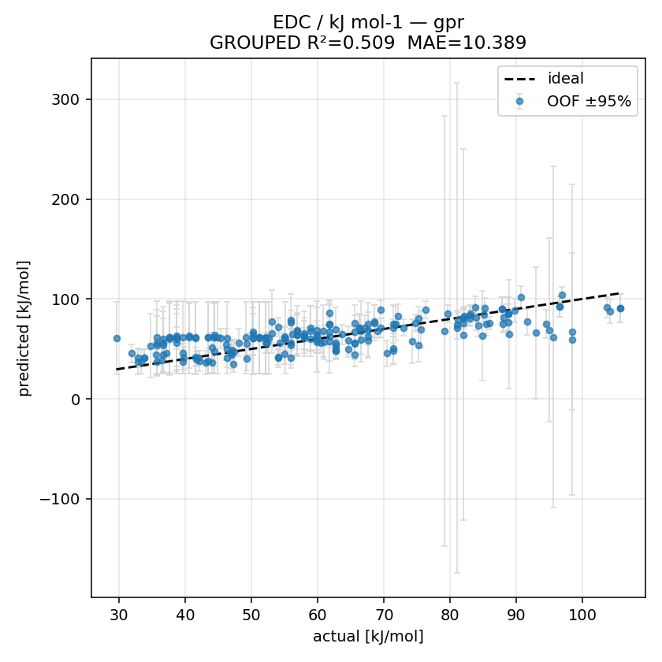
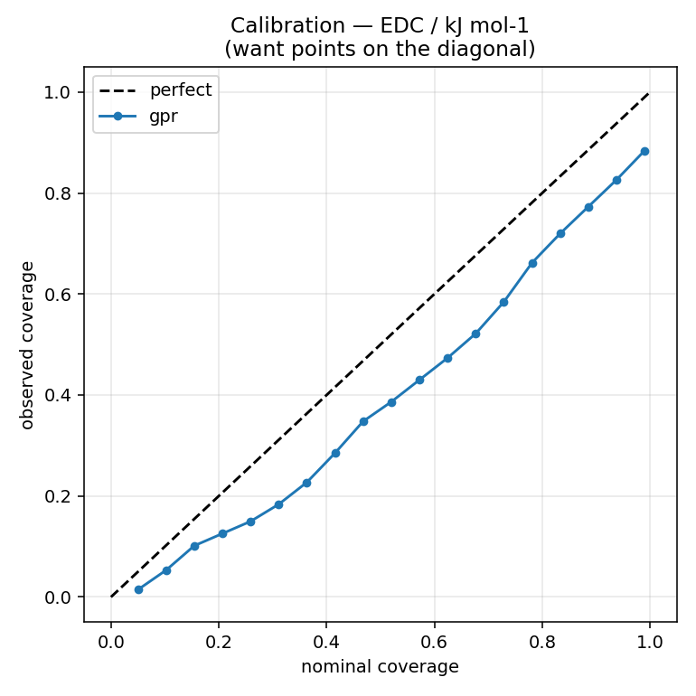

# Phosphate-glass model evaluation

- data source: **real: data/processed/global_dataset_with_features.csv**
- features: 22 (12 composition + 10 physics)
- all metrics are out-of-fold under leave-one-system-out GroupKFold
- `PICP95` = coverage of the 95% interval (want ≈0.95); `MPIW` = mean interval width (sharpness, lower is better)

## Density  (n=265, systems=39, units=g/cm^3)

| model | grouped R² | random R² | MAE | RMSE | PICP95 | MPIW |
|---|---|---|---|---|---|---|
| mean | -0.0194 | -0.0145 | 0.3644 | 0.5151 |  |  |
| bridge | 0.9223 | 0.9439 | 0.0993 | 0.1422 | 0.9245 | 0.4534 |
| gpr | 0.9178 | 0.9646 | 0.0978 | 0.1463 | 0.8604 | 0.4282 |
| physics_gp **★** | 0.9226 | 0.9667 | 0.0947 | 0.1419 | 0.8491 | 0.4381 |

- **workhorse:** `physics_gp` (chosen by grouped R²)
- **y-scramble grouped R²:** -0.218 ± 0.113  *(must be ≈0 / negative — proves it isn't fitting noise)*

## Tg  (n=253, systems=37, units=C)

| model | grouped R² | random R² | MAE | RMSE | PICP95 | MPIW |
|---|---|---|---|---|---|---|
| mean | -0.0153 | -0.0082 | 111.6924 | 139.8873 |  |  |
| bridge | 0.2072 | 0.6647 | 85.247 | 123.6155 | 0.8379 | 307.6699 |
| gpr **★** | 0.7183 | 0.9317 | 55.3248 | 73.6896 | 0.8972 | 221.3728 |

- **workhorse:** `gpr` (chosen by grouped R²)
- **y-scramble grouped R²:** -0.064 ± 0.007  *(must be ≈0 / negative — proves it isn't fitting noise)*

## conductivity @30°C  (n=161, systems=33, units=log10(S/cm))

| model | grouped R² | random R² | MAE | RMSE | PICP95 | MPIW |
|---|---|---|---|---|---|---|
| mean | -20.545 | -20.545 | 9.2774 | 9.5005 |  |  |
| bridge | 0.2937 | 0.5522 | 1.4209 | 1.7201 | 0.8882 | 5.6449 |
| gpr **★** | 0.3196 | 0.8458 | 1.2518 | 1.6883 | 0.7764 | 4.2147 |

- **workhorse:** `gpr` (chosen by grouped R²)
- **y-scramble grouped R²:** -0.076 ± 0.023  *(must be ≈0 / negative — proves it isn't fitting noise)*

## EDC / kJ mol-1  (n=207, systems=35, units=kJ/mol)

| model | grouped R² | random R² | MAE | RMSE | PICP95 | MPIW |
|---|---|---|---|---|---|---|
| mean | -0.0865 | -0.0102 | 16.1628 | 19.4021 |  |  |
| bridge | 0.467 | 0.7117 | 10.8626 | 13.59 | 0.8889 | 50.2861 |
| gpr **★** | 0.5088 | 0.9052 | 10.3886 | 13.045 | 0.8406 | 46.0512 |

- **workhorse:** `gpr` (chosen by grouped R²)
- **y-scramble grouped R²:** -0.049 ± 0.033  *(must be ≈0 / negative — proves it isn't fitting noise)*

